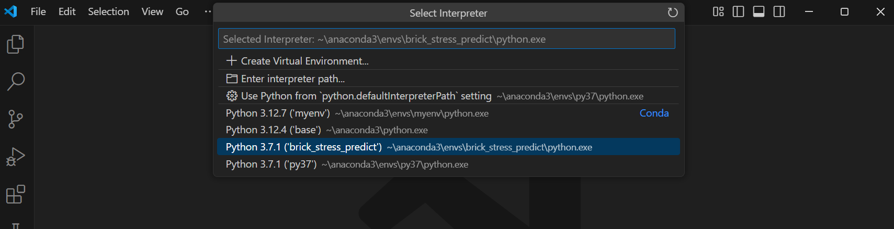
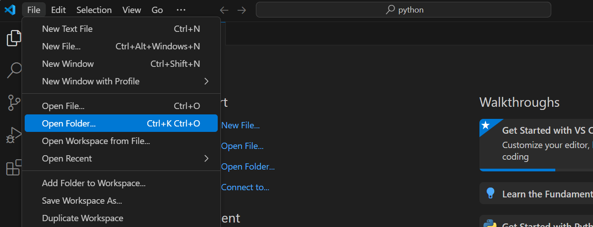
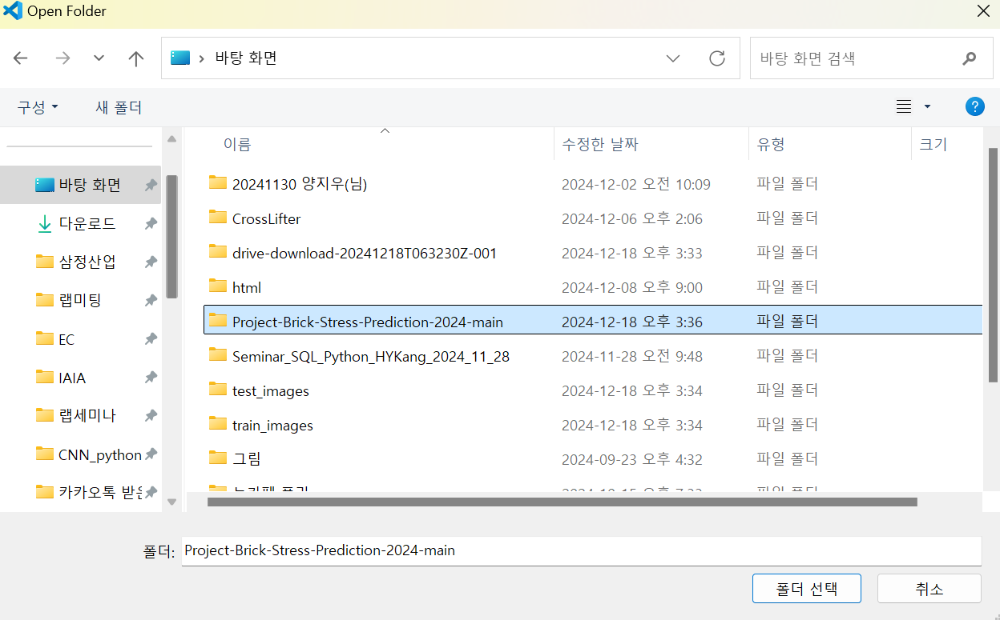

# 콘크리트 벽돌의 재료 구성 및 벽돌 표면 이미지와 압축강도의 상관관계 및 압축강도 예측 모델 가능성 검토 - 코드 배포

***

Author: Ji-Woo Yang

date: Updated 2024-12-18

***

# 소개

이 코드는 링크 3.0 기업현안문제 해결 과제 '벽돌 압축강도 예측 가능성 검토' 를 진행하며, 작성한 코드로 '(주)삼정산업'에서 이미지와 재료 구성데이터로 학습 및 테스트를 할 수 있도록 공유하기 위해 작성된 코드입니다.


## I. 설치 및 구동 최소사양

### Software

* Window 11
* Python 3.7.1
* numpy 1.21.5
* pandas 1.3.5
* matplotlib 3.5.3
* scikit-image 0.19.3
* scikit-learn 1.0.2
* opencv-python 4.10.0.84
* seaborn 0.12.2
* joblib 1.3.2
* openpyxl 3.1.3

## II. 설치 가이드

### 1. 필수 프로그램 설치

* 아래 링크 접속 후 '프로그램' 폴더에서 **Anaconda** 및  **Visual Studio Code** 설치

  링크:[프로그램 설치 링크](https://drive.google.com/drive/folders/17hETWHocpstpEn11QRXIgFDLfs2KH_nA?usp=sharing)

### 2. 아나콘다 가상환경 설치

* 아나콘다 명령 프롬프트 실행


* 아나콘다 업데이트

```bash
conda update -n base -c defaults conda
```

* Python 3.12에 대한 가상환경 생성

```bash
conda create -n brick_stress_predict python=3.7.1
```

* 가상환경 활성화

```bash
conda activate brick_stress_predict
```

* 필요 라이브러리 설치

```bash
pip install numpy==1.21.5 pandas==1.3.5 matplotlib==3.5.3 scikit-image==0.19.3 scikit-learn==1.0.2 opencv-python==4.10.0.84 seaborn==0.12.2 joblib==1.3.2 openpyxl==3.1.3
```


## III. 구성

* data: train과 test를 위한 입/출력 데이터

  * train: train에 대한 입/출력
    * input: train 입력
      * excel: 수치 데이터
      * images: 이미지 데이터
    * output: train 출력
      * model: 학습된 모델 저장
  * test: test에 대한 입/출력
    * input: test 입력
      * excel: 수치 데이터
      * images: 이미지 데이터
    * output : 예측된 압축강도, 공극률

  

* mian.py: train 및 test를 진행하는 코드( Train 모드 & Test 모드 존재)

* testModel.py: Test 모드 함수 코드

* trainModel.py: Train 모드 함수 코드

* config.py: 파일 경로 및 고정 값 코드

* loadData.py: Train 및 Test 입력 데이터 로드 코드

* scaler.save: 학습 시 입력 데이터의 최소/최대값이 저장된 스케일러

  * 학습시 자동 업데이터 됨
  * 데이터 정규화 시 사용됨
  
  

## IV. 실행 가이드

### 0. 준비사항

* 제공 소프트웨어 설치된 PC

### 1.  전체 .zip file 다운로드

깃허브의 레포지토리에 대한 .zip file을 다운로드 후 압축 풀기

### 2. 이미지 데이터 다운로드

아래 링크로 들어가서 이미지 데이터를 다운로드 받고 해당 경로에 이미지 데이터 저장

링크: [이미지 데이터](https://drive.google.com/drive/folders/1Nnqhqnq9fs8fZnSt1rJrb2SXsN8T9k7W?usp=drive_link)

**저장경로**

* train_images : data/train/input/images
* test_images : data/test/input/images

  * **각 images 폴더에는 이미지 데이터가 들어있어 함.**

### 3. VS code interpreter 변경

* **VS code** 실행
* '**F1**' 키 누르고 **Select interpreter**  클릭


* interpreter를 'brick_stress_predict'로 설정



### 4. 코드 실행

* 폴더 선택 - 'Project-Brick-Stress-Prediction-2024-main'





* main.py를 연다.

* config.py 에서 mode 설정을 한다
  
* mode = 'train' or 'test'
  
* main.py로 돌아가 코드 실행
  * train mode

    * 학습이 진행
    * 학습된 모델이 파일에 저장(저장경로: train/output/model)
    * 모델 성능 터미널 출력 

  * test mode

    * 학습된 모델과 테스트 데이터를 불러와 테스트 진행
      * 학습된 모델을 불러올때는 config.py의 test_model_path에서 저장된 모델 이름으로 수정 필요

    * 테스트 결과는 test/output 파일에 저장됨

    

### 5. 기타

* 새로운 데이터 학습할 경우
  * data/train/input/excel로 이동
    * 벽돌 번호, 재료구성, 무게, 압축강도 입력
  * data/train/input/images로 이동
    * 한 벽돌당 4개의 표면 이미지 필요(*배경 존재하면 안됌)
    * 이미지 파일 이름을 형식에 맞게 변경
      * 파일 이름 형식: "{벽돌 번호}-{표면번호}.jpg"
      * 벽돌 번호는 excel에 입력한 벽돌과 일치
      * 표면 번호는 1~4 존재. 순서는 관계 X
* 새로운 데이터로 테스트 할 경우
  * data/test/input/excel로 이동
    * 벽돌 번호, 재료구성, 무게 **( 압축강도는 입력하지 않음 )**
  * data/test/input/images로 이동
    * 학습때와 동일

